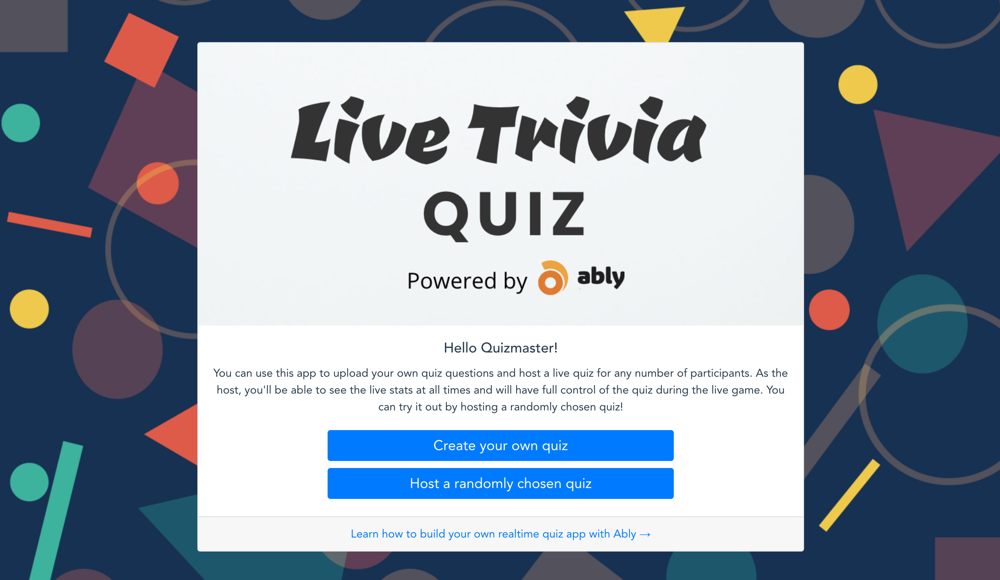
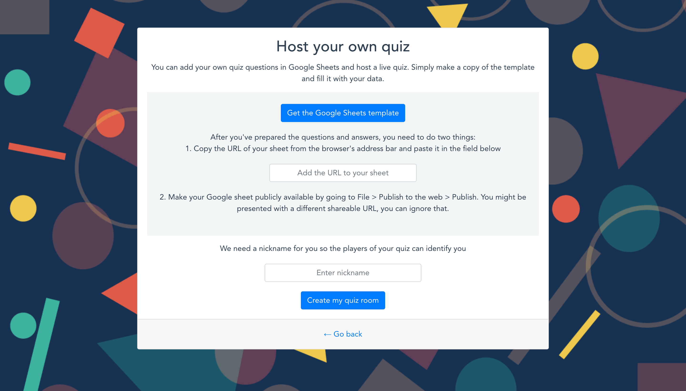
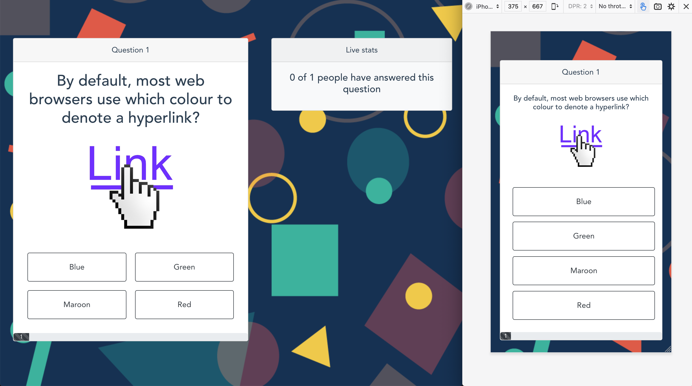
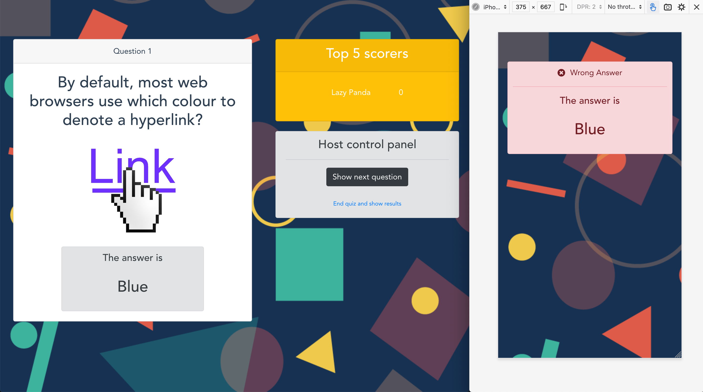
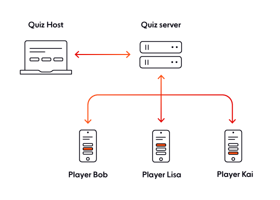
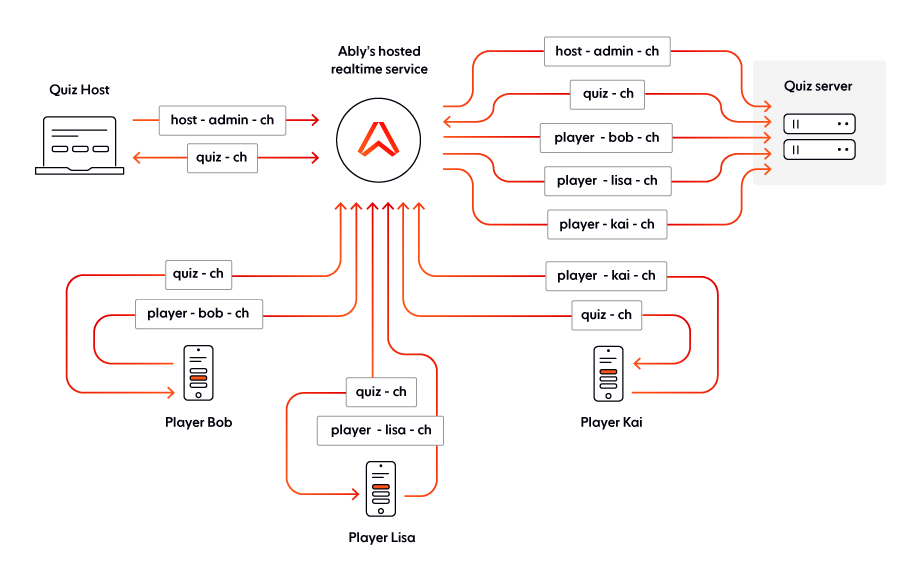

# A scalable, full-stack live quiz framework built with VueJS and NodeJS

This repository contains a scalable framework for building a real-time quiz app, which can double up as a test-taking app in an e-learning scenario or be used for a Pub Quiz Friday with your work mates.



It provides full control of the sequence of events to the host and is able to simultaneously run any number of quiz rooms, with any number of people in each of those (using Node JS worker threads!).



The hosts have an option to add their own questions, optionally with images, via Google Sheets.





The real-time messaging is powered by [Ably’s real-time infrastructure](https://www.ably.com), meaning, it can have enterprise-level scalability without needing to change anything in the code. Ideally, you’d take this open-sourced framework as a starting point and customize it to make it your own.

This framework is built on top of the [multiplayer games networking framework](https://github.com/Srushtika/multiplayer-games-scalable-networking-framework) that allows continuous streaming of data between various players and the game server. This framework is a bit different in that it allows for a more on-demand progression of the app by giving adequate controls of the app flow to the host.

You can check out a [blog article](https://www.ably.com/blog/a-scalable-realtime-quiz-framework-to-build-edtech-apps/) I wrote, to learn more about the uses of this framework.

#### Check out the [functional demo](https://quiz.ably.dev/) for this realtime quiz framework.

---

### The tech stack

##### Frameworks/ Languages

- [Vue JS](https://vuejs.org/)
- [Node JS](https://nodejs.org/en/)

##### Libraries

- [Ably Realtime](https://ably.com/)
- [Express](https://expressjs.com/)
- [Vue Router](https://router.vuejs.org/)
- [Axios](https://www.npmjs.com/package/axios)
- [G Sheets API](https://www.npmjs.com/package/g-sheets-api)
- [Bootstrap](https://getbootstrap.com/)
- [DotEnv](https://www.npmjs.com/package/dotenv)

### How to run this framework locally

1. Clone this repository

```sh
git clone https://github.com/ably-labs/realtime-quiz-framework.git
```

2. Change directory to the project folder and Install dependencies

```sh
npm install

cd realtime-quiz/
npm install

cd ..
```

**TIP:** you can do exactly the same thing with one command
by concatenating the commands with `&&`.

Here we use the shorthand `npm i` instead of `npm install`.

```
npm i && cd realtime-quiz/ && npm i && cd ..
```

3. Create a free account with [Ably Realtime](https://www.ably.com/) to get your Ably API KEY. Add a new file called `.env` and add the following, or use the example `.env.example` and save that as `.env`.(Remember to replace the placeholder with your own API Key. You can get your Ably API key from your Ably dashboard):

```
ABLY_API_KEY=<YOUR-ABLY-API-KEY>
PORT=5000
```

4. Run the server

```sh
node server.js
```

5. Open the app in your browser at [http://localhost:5000](http://localhost:5000). Choose the quiz type and create a quiz room.

6. Copy the shareable link and open it in a separate browser window. This is best experienced in mobile view. Open multiple of these to simulate multiple players if you like.

7. Start the quiz when you are ready and have the players answer the questions as they appear.

Voila! Your live quiz framework is up and running. Customize this framework and make it your own. Feel free to share your quiz app with me on [Twitter](https://twitter.com/Srushtika), I'll be happy to give it a shoutout!

---

### What’s in which file?

#### Server-side files

1. `server.js`

This file has the main server thread. It performs three functions:

- Serve the front-end VueJS app using Express.

- Authenticate front-end clients with the Ably Realtime service using [Token Auth strategy](https://www.ably.com/documentation/core-features/authentication#token-authentication).

- Create and manage Node JS worker threads when a host requests to create a quiz room.

2. `quiz-room-server.js`

This file represents a Node JS worker thread. A new instance of this file will run for every quiz room created.

After a live quiz session is finished, the relevant worker thread is killed. When a new player joins or leaves the worker thread communicates with the parent thread (i.e. main thread aka server.js) and lets it know the number of players (among other things).

3. `quiz-default-questions.js`

This file exports a JSON array with a set of quiz questions with options and correct answers. This will be used by the `quiz-room-server` when a host chooses the "Host a randomly chosen quiz" option.

#### Client-side files

The client-side is written in VueJS with the following file structure (Note: Only the relevant files are listed here)

```
realtime-quiz
|___dist
|___public
|   |___index.html
|___src
    |___main.js
    |___routes.js
    |___App.vue
    |___components
        |
        |___common
        |   |___Answer.vue
        |   |___OnlinePlayers.vue
        |   |___Question.vue
        |
        |___host
        |   |___AdminPanel.vue
        |   |___CreateQuizRoom.vue
        |   |___HostHome.vue
        |   |___Leaderboard.vue
        |   |___LiveStats.vue
        |
        |___player
            |___PlayerHome.vue
```

1. `dist` folder

   The dist folder contains the built Vue app that is auto-generated when you run the `npm run build` command after finishing your work on the Vue app. The `index.html` file in this folder is what’s served by our express server (for all routes, as routing is handled in the front-end using `vue-router`)

2. `public` folder

   The public folder contains the `index.html` file inside which all the components will be rendered based on the app logic.

3. `src` folder, `main.js` and `routes.js`

   The src folder contains our app files starting with the main.js file which instantiates a new Vue instance with `App.vue` being the top-level component. We also instantiate the Vue Router instance in this file. The different components to be rendered based on the routes are listed in the routes.js file.

4. `App.vue`

   As this is the top-level component for our Vue app, it instantiates the Ably library using the Token Authentication strategy and passes on the `realtime` instance to its child components so they can use it as they need.

5. `components` folder
   This folder contains all the child components for `App.vue`. They are placed in different folders for a better context.

   The `common` folder has components that are common to the host of the quiz app and the players. The `host` folder has components that are visible to the host only. The `player` folder has components that are visible to the player only.

6. `common/OnlinePlayers.vue`

   This component holds the logic and UI to show a staging area with a list of players who are online. New players are added to this list as they join in realtime. For every player, a thumbnail of their randomly chosen unique colored avatar along with a name as a tagline underneath appears.

7. `common/Question.vue`

   This component holds the logic and UI to show a card with the question, optionally an image, and four options.

   The players have buttons to choose one of the options whereas the host has the options listed as non-clickable divs as they won’t be answering the questions.

8. `common/Answer.vue`

   This component holds the logic and UI to show a card with the answer. For the player, this component appears standalone and also indicates if the option they chose was correct or not. For the host, this component replaces the four options in the question.

9. `host/HostHome.vue`

   This is the main component that is shown when anyone lands on the app. By default, all the hosts land on this page and they get a shareable URL to invite their players after they have chosen the type of quiz they'd like to host. This component allows the host to choose the quiz type and provides a way to upload their own questions if they need.

10. `host/CreateQuizRoom.vue`

    This component holds the logic and UI to allow the host to create a new quiz room and get a shareable URL to invite players to that quiz room.

11. `host/Leaderboard.vue`

    This component is visible to the host after every question. It shows the top five scorers in the quiz until that point. If the quiz has ended, the same component displays a full leaderboard with all the participants.

12. `host/AdminPanel.vue`

    This component is visible to the host after every question, giving them options to show the next question when they are ready, or end the quiz midway through.

13. `host/LiveStats.vue`

    This component is visible to the host at the time of a question being displayed. It shows live stats on how many players are still online and out of those, how many have already selected an option for that question. This component can be extended to include the names of the players who have answered, as they do, or any other live stats.

14. `player/Playerhome.vue`

    This component is visible to the player. This is the first page they see when they follow a link shared by their host. It allows them to add their nickname and enter the quiz room created by their host. They’ll be waiting along with other players until the host decides to start the quiz.

If you want to learn more about the source code, you should check out the [TUTORIAL.md](https://github.com/Srushtika/realtime-quiz-framework/blob/main/TUTORIAL.md) for a more thorough breakdown.

## Core concepts

### The communication architecture

Before we look at the architecture and design of the app, we need to understand a few concepts based on which this app is built

#### App architecture

This app is designed in a way where the server can be considered as the single source of truth and is responsible to maintain the latest quiz state at all times.

All the players send their answers to the server, which in turn collates them together, computes the leaderboard, and sends this info to the host of the quiz. The server is also responsible for publishing new questions, the timer in between questions, and the correct answer after the time has elapsed or all the players have answered.

The client-side script will use this information from the server and render various components accordingly, ensuring all the players are fully in-sync.



#### The WebSockets protocol

The [WebSockets protocol](https://www.ably.com/concepts/websockets), unlike HTTP, is a stateful communications protocol that works over TCP. The communication initially starts off as an HTTP handshake, but if both the communicating parties agree to continue over WebSockets then the connection is elevated; giving rise to a full-duplex, persistent connection. This means the connection remains open for the duration that the application is in use. This gives the server a way to initiate any communication and send data to pre-subscribed clients, so they don’t have to keep sending requests inquiring about the availability of new data. Which is exactly what we need in our quiz!

This project uses [Ably Realtime](https://www.ably.com) to implement WebSocket based realtime messaging between the server, host and the players. Ably, by default, deals with scalability, protocol interoperability, reliable message ordering, guaranteed message delivery, historical message retention and authentication, so we don't have to. This communication follows the [Pub/Sub messaging pattern](https://www.ably.com/concepts/pub-sub).

##### Publish/Subscribe messaging pattern

[Pub/Sub](https://www.ably.com/concepts/pub-sub) messaging allows various front-end or back-end clients to publish some data and/or subscribe to some data. For any active subscriptions, these clients will receive asynchronous event callbacks when a new message is published.

##### Channels

In any realtime app, there's a lot of moving data involved. [Channels](https://www.ably.com/documentation/core-features/channels) help us group this data logically and let us implement subscriptions per channel. This allowing us to implement the custom callback logic for different scenarios. In the diagram above, each color would represent a channel.

##### Presence

[Presence](https://www.ably.com/documentation/core-features/presence) is an Ably feature using which you can track the connection status of various clients on a channel. In essence, you can see who has just come online and who has left using each client's unique `clientId`

#### Sequence of events with Node JS worker threads (For an example quiz)



---

## Load tests and limits

- All of Ably's messaging limits, broken down by package can be found in a [support article](https://support.ably.com/support/solutions/articles/3000053845-do-you-have-any-connection-message-rate-or-other-limits-on-accounts-).

- We are currently performing load and performance tests on this framework and will update this guide with that info when it's available. If this is important to you, please [leave a message to me directly on Twitter](https://www.twitter.com/Srushtika) or reach out to Ably's support at [support@ably.com](mailto:support@ably.com)
